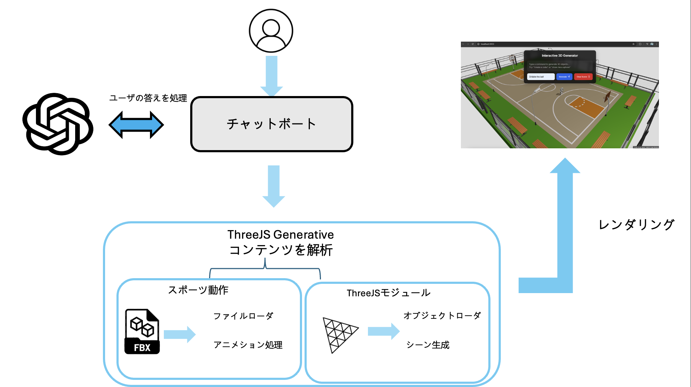
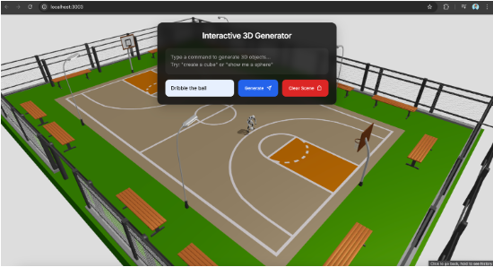

# 大学2年生後期ゼミまとめ

---

## 概要

- 3Dオブジェクトを生成するシステムを作成した。具体的には、GPTのAPIキーを用いて、ユーザーの入力に応じて3Dオブジェクトを生成するシステムを作成した。また、試しにドリブルシュートのシミュレーションを作成した。
- 本プロジェクトは、3D表現とAIの融合による新しいインタラクティブシステムの可能性を探究することを目的としている。

## 使用した技術

### フロントエンド
- Three.js (3Dグラフィックスライブラリ)
  - FBXLoader: 3Dモデルの読み込み
  - OrbitControls: カメラ制御
  - AxesHelper: 座標軸の可視化

### バックエンド
- Node.js
  - Express.js: WebAPIの構築

### API
- OpenAI API (GPT-4o-mini)
  - テキスト入力の解析
  - 3Dオブジェクトの生成指示の作成

## アーキテクチャ

### システムフロー
1. フロントエンド：ユーザーからのテキスト入力受付
2. バックエンド：OpenAI APIへのリクエスト処理
3. OpenAI API：テキストから3Dオブジェクト生成の指示を生成
4. 3Dレンダリング：指示に基づくオブジェクトの表示

## システムの特徴

### インタラクション機能
- テキストベースの3Dオブジェクト生成
- リアルタイムプレビュー
- オブジェクトの回転・拡大縮小
- カメラアングルの自由な調整

### シミュレーション機能
- バスケットボールのドリブルシュート物理演算
- 衝突判定
- 重力と摩擦の計算

## 実装の詳細

### 3Dオブジェクト生成プロセス
1. ユーザーからのテキスト入力
2. OpenAI APIによる入力の解析
3. 3Dオブジェクトの生成指示の取得
4. Three.jsによる3Dモデルの生成
5. シーンへの配置

### パフォーマンス最適化
- オブジェクトのキャッシング
- レンダリングの最適化
- メモリ管理

## 成果

### 達成した目標
- 自然言語による3Dオブジェクト生成の実現
- リアルタイムシミュレーションの実装
- インタラクティブな操作性の実現

## まとめ

- Three.jsを活用した3Dオブジェクト生成システムの実装
- OpenAI APIを利用した自然言語からの3Dオブジェクト生成
- バスケットボールのドリブルシュートシミュレーション実装

## 今後の課題

### 技術的な改善点
- 3Dオブジェクトの生成精度向上
- より複雑なシミュレーションの実装
- パフォーマンスの最適化

### 機能拡張
- より多様な3Dオブジェクトのサポート
- アニメーション機能の強化
- ユーザーインターフェースの改善

### 将来の展望
- より自然な物理演算の実装
- ユーザビリティの向上
- 実用的なアプリケーションへの展開

## 参考文献
1. Three.js Documentation (https://threejs.org/docs/)
2. OpenAI API Documentation (https://platform.openai.com/docs/)
